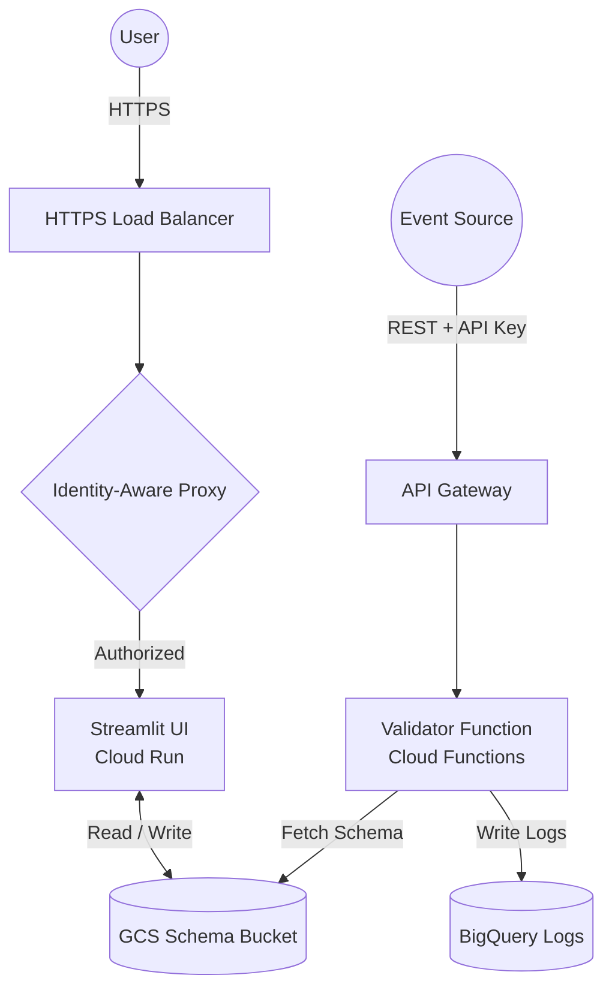

# Events Validator (Core)

A scalable, serverless solution for real-time JSON event validation on Google Cloud Platform. It allows anyone to easily validate the quality of any in-app event data (e.g., coming from server-side Google Tag Manager) before it hits your analytics or marketing destinations.

## 🏗️ Architecture



## 📁 Project Structure

- **`validator_src/`**: Node.js source code for the Cloud Function.
- **`terraform_backend/`**: Infrastructure as Code (Terraform) for backend services - Cloud Function, BigQuery, GCS buckets, API Gateway.
- **`terraform_ui/`**: Infrastructure as Code (Terraform) for UI services - Streamlit Cloud Run, Load Balancer, IAP authentication.
- **`streamlit_ev/`**: (Optional) UI for schema management and parameter building.

## 🚀 Key Features

*   **Dynamic Schema Loading**: Loads JSON schemas from GCS based on event names.
*   **BigQuery Logging**: Automatically logs validation results and processing errors for auditing.
*   **Performance Optimized**: Parallel fetching and analysis (GCS + Health checks) ensures a snappy UI even with 100+ schemas.
*   **API Gateway Secured**: Protected by API Keys with automated managed service activation.
*   **Fully Automated**: One-click deployment with built-in propagation delays for stability.
*   **GA4 Ready**: Pre-loaded with 36 recommended GA4 event schemas and a master parameter repository.

## 🏷️ Sample GTM Setup

To validate data from Server-Side Google Tag Manager (sGTM), send the entire Event Data object to the validator function, eg. using the **"JSON HTTP Request"** tag (e.g., the popular template by stape.io) following the following steps:

1.  **Tag Type**: Use the **JSON HTTP Request** tag.
2.  **Destination URL**: Set to your `https://<API_GATEWAY_URL>/eventsValidator?key=<API_KEY>`.
3.  **Body**: Select the "Include in the body all Event Data" option.
4.  **Triggering**: It is **highly recommended** to sample incoming data based on volume to manage costs.
    *   *Option*: Use a specific Trigger in GTM to select only certain event types (e.g., `purchase`, `sign_up`) or validation-prone events.

## 📋 Event Schema & Validation

The validator expects a JSON body with a `data` object containing the event details.

### Expected Format
```json
{
  "data": {
    "event_name": "your_event_name",
    "param_1": "value_1",
    "param_2": 123
  }
}
```

### ✅ Validation Capabilities

The validator supports two levels of features: those accessible via the **Streamlit UI** (for easy management) and the full set supported by the **Cloud Function** (for advanced use cases via manual schema editing).

#### 1. Streamlit UI (No-Code)
The UI allows you to define these validations visually:
*   **Structure Validation**: Automatically checks if required parameters are present in the event.
*   **Type Checking**: `string`, `number`, `boolean`, `array`.
*   **Exact Match**: Enforce a specific value (e.g., `event_name` must be `purchase`).
*   **Regex Pattern**: Validate strings against a Regular Expression (e.g., `^user_\d+$`).
*   **Array Items**: Define a schema for items within an array.
*   **"Any" Value**: Enforces the **Type** but ignores the specific value.
*   **Nullable Numbers**: In the UI, clearing a number field sets it to "empty" (null/undefined) rather than `0`.

#### 2. Cloud Function (Full Engine)
The core validation engine (`validator_src`) supports additional advanced features if you edit JSON schemas manually:
*   **Object Type**: Validate nested JSON objects (not just arrays of objects).

*   **Exact Length**: Validate that an array or string has a specific exact length (via `length` property in JSON).
*   **Required/Optional**: By default, all fields in the schema are **Required**. You can mark fields as `optional: true` in the JSON to allow them to be missing.


#### ℹ️ Supported Data Types
| Type | Description | UI Support | Code Support |
| :--- | :--- | :---: | :---: |
| `string` | Text values. | ✅ | ✅ |
| `number` | Integers or Floats. | ✅ | ✅ |
| `boolean` | `true` or `false`. | ✅ | ✅ |
| `array` | List of items (can have nested schemas). | ✅ | ✅ |
| `object` | Nested JSON object. | ❌ | ✅ |
| **regex** | Regular Expression Pattern. | ❌ | ✅ |

> [!TIP]
> **Regex Best Practice**: For strict validation, always use start (`^`) and end (`$`) anchors. Without them, the validator accepts partial matches (e.g., pattern `\d+` will validly match `"abc123xyz"`).

### 🔧 Advanced Schema Configuration (Manual Edit)

To utilize features not yet available in the UI (like nested Objects, Regex patterns, or exact length checks), you can manually edit the JSON schema file in your Google Cloud Storage bucket.

#### 1. Nested Object Validation
Use this structure to validate a generic object (e.g. `user_info`) containing specific fields.

```json
"user_info": {
  "type": "object",
  "nestedSchema": {
    "user_id": { "type": "string" },
    "is_active": { "type": "boolean" }
  }
}
```

#### 2. Exact Length (`length`)
Validates that a **String** or **Array** has an exact specific length.
*(Note: This is strictly for exact length, not min/max).*

```json
"transaction_id": {
  "type": "string",
  "length": 10
},
"items": {
  "type": "array",
  "length": 3,
  "nestedSchema": { ... }
}
```

#### 3. Optional Fields
By default, the validator treats every field defined in the schema as **Required**. If a required field is missing or empty, validation fails.
Use `"optional": true` to allow a field to be missing, `null`, or an empty string.

```json
"promo_code": {
  "type": "string",
  "optional": true
}
```


## 💰 Cost Estimation

Running this setup on GCP is designed to be cost-effective for validation workloads.

*   **Approximate Cost**: ~$0.50 per day for ~50,000 processed events.
*   *Includes*: Cloud Functions invocations, Cloud Storage class A/B operations, and minimal BigQuery streaming ingestion.
*   *Note*: Costs may vary based on exact payload size and region.

### 📊 Granular Logging Control
Configure these flags in `terraform_backend/terraform.tfvars` to balance visibility with storage costs:

| Flag | Description |
| :--- | :--- |
| `LOG_VALID_FIELDS_FLAG` | Logs every single validated field (even if correct). |
| `LOG_PAYLOAD_WHEN_ERROR_FLAG` | Attaches the full JSON payload when an error is found. |
| `LOG_PAYLOAD_WHEN_VALID_FLAG` | Attaches the full JSON payload for successful events. |

---

## 🛠 Prerequisites

1.  **GCP Project**: An active Google Cloud Project.
2.  **Tools**:
    *   [Terraform](https://developer.hashicorp.com/terraform/downloads) (>= 1.5.0)
    *   [gcloud CLI](https://cloud.google.com/sdk/docs/install) (authenticated: `gcloud auth application-default login`)
3.  **Local Node.js**: (Optional, for local testing) Node.js 20+.

## 🔑 GCP Service Account Setup

You need a **Deployer Service Account** to run Terraform. **Never commit the `.json` key to Git.**

1.  Create a Service Account in the [IAM Console](https://console.cloud.google.com/iam-admin/serviceaccounts).
2.  **Assign Roles**:
    *   `Editor` (Fastest for testing) **OR** the following specific roles:
        *   `API Keys Admin` (For Gateway security)
        *   `ApiGateway Admin` (For the entry point)
        *   `Artifact Registry Administrator` (For UI images)
        *   `BigQuery Admin` (For logs)
        *   `Cloud Functions Admin` & `Cloud Run Admin` (For the validator function and UI)
        *   `Compute Admin` (For Load Balancer and Global IPs)
        *   `IAP Policy Admin` & `IAP Settings Admin` (For UI authentication)
        *   `Project IAM Admin` (To grant permissions to worker accounts)
        *   `Service Account Admin` & `Service Account Key Admin` (To manage identities)
        *   `Service Management Administrator` & `Service Usage Admin` (To enable APIs automatically)
        *   `Storage Admin` (For logs and schemas)
    *   `Service Account User` (Always required for Terraform to deploy resources)
3.  Generate a JSON key and save it as `terraform_backend/credentials.json` (and `terraform_ui/credentials.json` if deploying UI).

---

## 📂 File Ownership & Environment

To achieve a "Zero-Touch" experience, Terraform manages most configuration files.

| File | Component | Owned By | Description |
| :--- | :--- | :--- | :--- |
| `terraform_backend/credentials.json` | Backend | **User** | Deployer Service Account key (Manual). |
| `terraform_backend/terraform.tfvars` | Backend | **User** | Backend project configuration (Manual). |
| `terraform_ui/credentials.json` | UI | **User** | Deployer Service Account key (Manual). |
| `terraform_ui/terraform.tfvars` | UI | **User** | UI project configuration (Manual). |
| `streamlit_ev/.env` | UI | **Terraform** | App config: Bucket, Project, etc. |

> [!IMPORTANT]
> Files owned by **Terraform** are managed automatically. Do not edit them manually.

---

## 🚀 Deployment (Terraform)

The infrastructure is split into two independent projects for flexibility:

> [!IMPORTANT]
> Before running `terraform apply`, you **must** create your own `terraform.tfvars` file from the provided example in each project directory. The `.tfvars` files contain sensitive configuration and are not committed to the repository.

### Step 1: Deploy Backend (Required)

```bash
cd terraform_backend

# Create your configuration file from the example
cp terraform.tfvars.example terraform.tfvars

# Edit terraform.tfvars with your project_id, region, location, and logging flags
# IMPORTANT: Update all placeholder values before proceeding

terraform init
terraform apply
```
*(Note: The deployment includes a 60s delay to allow Google's API Gateway to propagate.)*

**Save the outputs** - you'll need them for the UI deployment:
```bash
terraform output schemas_bucket
terraform output bq_dataset
terraform output bq_table
```

### Step 2: Deploy UI (Optional)

```bash
cd terraform_ui

# Create your configuration file from the example
cp terraform.tfvars.example terraform.tfvars

# Edit terraform.tfvars with your project_id, region, schemas_bucket (from backend), and IAP credentials
# IMPORTANT: Update all placeholder values, including the schemas_bucket from Step 1 outputs

terraform init
terraform apply
```

---

## 🧪 Verification

1.  **Get Endpoint Details**:
    ```bash
    cd terraform_backend
    terraform output api_gateway_url
    terraform output api_key
    ```
2.  **Test the Validator**:
    ```bash
    curl -X POST "https://<URL>/eventsValidator?key=<KEY>" \
    -H "Content-Type: application/json" \
    -d '{
      "data": {
        "event_name": "example",
        "example_param": "success"
      }
    }'
    ```
    *Response:* `{"status":"event valid","eventsLogged":1}`

---

## 💡 Schema Management UI (Streamlit)

The `streamlit_ev/` application provides a "Parameter Repository" approach to schema management.

### Keyless Setup
If you deployed using the steps above:
- **Backend** (`terraform_backend`) has:
  1.  Created the schema bucket and pre-loaded 36 GA4 schemas and `repo.json`.
  2.  Created the BigQuery dataset and table for validation logs.
- **UI** (`terraform_ui`) has:
  1.  Created a dedicated `streamlit-worker` Service Account.
  2.  Granted it `Storage Object Admin` permissions on the schema bucket.
  3.  Granted it `BigQuery Data Viewer` and `Job User` permissions for reading logs.
  4.  Generated `streamlit_ev/.env` with your project, bucket, and BigQuery details.

### Local Start
1.  **Authenticate**: `gcloud auth application-default login`
2.  `cd streamlit_ev`
3.  **Install Dependencies**:
    ```bash
    uv sync
    ```
4.  **Run**:
    ```bash
    uv run streamlit run app/app.py
    ```

### Production Deployment (Cloud Run + IAP)

#### 1. Manual Prerequisites
Before deploying to the cloud, you **must** configure the following using Google Cloud Console:
1.  **[OAuth Consent Screen](https://console.cloud.google.com/apis/credentials/consent)**: Set to "Internal" and add `iap.googleapis.com` scope.
2.  **[OAuth Client ID](https://console.cloud.google.com/apis/credentials)**: Create a "Web application" ID and add this **Authorized redirect URI**:
    `https://iap.googleapis.com/v1/oauth/clientIds/YOUR_CLIENT_ID:handleRedirect` (Replace `YOUR_CLIENT_ID` with the actual ID).
3.  **Update Config**: Add `iap_client_id`, `iap_client_secret`, and the list of `authorized_users` to your **`terraform_ui/terraform.tfvars`** file.

> [!TIP]
> **User Identity Format**: In the `authorized_users` list (within `terraform.tfvars`), ensure you use the proper prefix:
> - Individual: `user:name@example.com`
> - Group: `group:marketing@example.com`

#### 2. Build and Deploy
1.  **Build Image**:
    ```bash
    gcloud builds submit --tag [REGION]-docker.pkg.dev/[PROJECT_ID]/event-validator-ui-repo/event-validator-ui:latest ./streamlit_ev
    ```
2.  **Terraform Apply**:
    ```bash
    cd terraform_ui
    terraform apply
    ```

### Features
- **Params Repo**: Centralized database of parameters with strict type validation.
- **Smart Sync & Diff Review**: See exactly what changed (JSON diff) before syncing Repo updates to GCS.
- **Performance Caching**: Session-based memoization for instant tab switching and bulk operations.
- **Overridable Values**: Assign specific values in the Builder while staying synced with Repo metadata.
- **Empty vs Zero Support**: Robust handling of numeric fields—set fields to "empty" (null) instead of forcing 0.0.
- **Explorer**: Direct visibility and health-check analysis for your GCS schema bucket.
- **Auto-Sync**: Propagate changes from the Repo to all GCS schemas with one click.
- **Health Checks**: Automatically detect when GCS schemas are out of sync with your repository.
- **Explorer**: Direct visibility into your GCS schema bucket.

---

## 📄 License & Maintainers

*   **License**: This project is licensed under the **GNU General Public License (GPL)**. It is free to use, fork, and modify.
*   **Contributions**: We encourage contributions! Please fork the repository and submit pull requests.
*   **Roadmap**: View the public roadmap at [github.com/orgs/defuseddata/projects/1](https://github.com/orgs/defuseddata/projects/1).
*   **Maintainer**: Maintained by [Defused Data](https://defuseddata.com).
