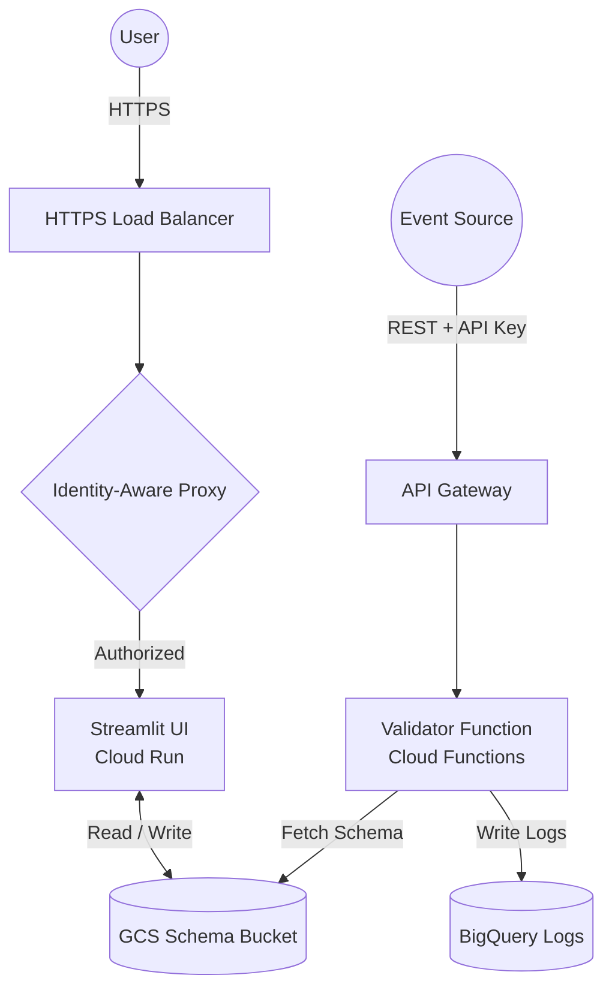

# Events Validator (Core)

A scalable, serverless solution for real-time JSON event validation on Google Cloud Platform. It allows anyone to easily validate the quality of any in-app event data (e.g., coming from server-side Google Tag Manager) before it hits your analytics or marketing destinations.

## 🏗️ Architecture



## 📁 Project Structure

- **`validator_src/`**: Node.js source code for the Cloud Function.
- **`terraform_ev/`**: Infrastructure as Code (Terraform) to deploy the Function, BigQuery, Storage, and API Gateway.
- **`streamlit_ev/`**: (Optional) UI for schema management and parameter building.

## 🚀 Key Features

*   **Dynamic Schema Loading**: Loads JSON schemas from GCS based on event names.
*   **BigQuery Logging**: Automatically logs validation results and processing errors for auditing.
*   **API Gateway Secured**: Protected by API Keys with automated managed service activation.
*   **Fully Automated**: One-click deployment with built-in propagation delays for stability.
*   **GA4 Ready**: Pre-loaded with 36 recommended GA4 event schemas and a master parameter repository.

## 🏷️ Sample GTM Setup

To validate data from Server-Side Google Tag Manager (sGTM), send the entire Event Data object to the validator function, eg. using the **"JSON HTTP Request"** tag (e.g., the popular template by stape.io) following the following steps:

1.  **Tag Type**: Use the **JSON HTTP Request** tag.
2.  **Destination URL**: Set to your `https://<API_GATEWAY_URL>/eventsValidator?key=<API_KEY>`.
3.  **Body**: Select the "Include in the body all Event Data" option.
4.  **Triggering**: It is **highly recommended** to sample incoming data based on volume to manage costs.
    *   *Option*: Use a specific Trigger in GTM to select only certain event types (e.g., `purchase`, `sign_up`) or validation-prone events.

## 📋 Event Schema & Validation

The validator expects a JSON body with a `data` object containing the event details.

### Expected Format
```json
{
  "data": {
    "event_name": "your_event_name",
    "param_1": "value_1",
    "param_2": 123
  }
}
```

### Supported Features
*   **Structure Validation**: Ensures required parameters are present.
*   **Type Checking**: Validates data types (string, number, boolean, etc.).
*   **Value Constraints**: (Optional) specific allowed values or regex patterns defined in your GCS schemas.
*   **Unknown Parameters**: Flags parameters not defined in the schema (configurable).

## 💰 Cost Estimation

Running this setup on GCP is designed to be cost-effective for validation workloads.

*   **Approximate Cost**: ~$0.50 per day for ~50,000 processed events.
*   *Includes*: Cloud Functions invocations, Cloud Storage class A/B operations, and minimal BigQuery streaming ingestion.
*   *Note*: Costs may vary based on exact payload size and region.

### 📊 Granular Logging Control
Configure these flags in `terraform_ev/terraform.tfvars` to balance visibility with storage costs:

| Flag | Description |
| :--- | :--- |
| `LOG_VALID_FIELDS_FLAG` | Logs every single validated field (even if correct). |
| `LOG_PAYLOAD_WHEN_ERROR_FLAG` | Attaches the full JSON payload when an error is found. |
| `LOG_PAYLOAD_WHEN_VALID_FLAG` | Attaches the full JSON payload for successful events. |

---

## 🛠 Prerequisites

1.  **GCP Project**: An active Google Cloud Project.
2.  **Tools**:
    *   [Terraform](https://developer.hashicorp.com/terraform/downloads) (>= 1.5.0)
    *   [gcloud CLI](https://cloud.google.com/sdk/docs/install) (authenticated: `gcloud auth application-default login`)
3.  **Local Node.js**: (Optional, for local testing) Node.js 20+.

## 🔑 GCP Service Account Setup

You need a **Deployer Service Account** to run Terraform. **Never commit the `.json` key to Git.**

1.  Create a Service Account in the [IAM Console](https://console.cloud.google.com/iam-admin/serviceaccounts).
2.  **Assign Roles**:
    *   `Editor` (Fastest for testing) **OR** the following specific roles:
        *   `Cloud Functions Admin` & `Cloud Run Admin` (For the validator function)
        *   `API Gateway Admin` & `Service Management Administrator` (For the entry point)
        *   `BigQuery Admin` & `Storage Admin` (For logs and schemas)
        *   `Service Account Admin` (To create user identities)
        *   `Project IAM Admin` (To grant permissions to the worker account)
        *   `Service Usage Admin` (To enable APIs automatically)
    *   `Service Account User` (Always required for Terraform to deploy resources)
3.  Generate a JSON key and save it as `terraform_ev/credentials.json`.

---

## 📂 File Ownership & Environment

To achieve a "Zero-Touch" experience, Terraform manages most configuration files.

| File | Component | Owned By | Description |
| :--- | :--- | :--- | :--- |
| `terraform_ev/credentials.json` | Infra | **User** | Deployer Service Account key (Manual). |
| `terraform_ev/terraform.tfvars` | Infra | **User** | Project configuration (Manual). |
| `streamlit_ev/.env` | UI | **Terraform** | App config: Bucket, Project, etc. |

> [!IMPORTANT]
> Files owned by **Terraform** are managed automatically. Do not edit them manually.

---

## 🚀 Deployment (Terraform)

1.  **Initialize**:
    ```bash
    cd terraform_ev
    cp terraform.tfvars.example terraform.tfvars
    ```
2.  **Configure**: Edit `terraform.tfvars` with your `project_id`, `region`, `location`, and the IAP credentials you created in the prerequisites.
3.  **Deploy**:
    ```bash
    terraform init
    terraform apply
    ```
    *(Note: The deployment includes a 60s delay to allow Google's API Gateway to propagate.)*

---

## 🧪 Verification

1.  **Get Endpoint Details**:
    ```bash
    terraform output api_gateway_url
    terraform output api_key
    ```
2.  **Test the Validator**:
    ```bash
    curl -X POST "https://<URL>/eventsValidator?key=<KEY>" \
    -H "Content-Type: application/json" \
    -d '{
      "data": {
        "event_name": "example",
        "example_param": "success"
      }
    }'
    ```
    *Response:* `{"status":"event valid","eventsLogged":1}`

---

## 💡 Schema Management UI (Streamlit)

The `streamlit_ev/` application provides a "Parameter Repository" approach to schema management.

### Keyless Setup
If you deployed using the steps above, Terraform has already:
1.  Created a dedicated `streamlit-worker` Service Account.
2.  Granted it `Storage Object Admin` permissions on the schema bucket.
3.  **Pre-loaded GA4 Data**: Uploaded 36 recommended GA4 schemas and the master `repo.json`.
4.  Generated `streamlit_ev/.env` with your project and bucket details.

### Local Start
1.  **Authenticate**: `gcloud auth application-default login`
2.  `cd streamlit_ev`
3.  **Install Dependencies**:
    ```bash
    uv sync
    ```
4.  **Run**:
    ```bash
    uv run streamlit run app/app.py
    ```

### Production Deployment (Cloud Run + IAP)

#### 1. Manual Prerequisites
Before deploying to the cloud, you **must** configure the following using Google Cloud Console:
1.  **OAuth Consent Screen**: Set to "Internal" and add `iap.googleapis.com` scope.
2.  **OAuth Client ID**: Create a "Web Internal" ID and add this Redirect URI:
    `https://iap.googleapis.com/v1/oauth/clientIds/YOUR_CLIENT_ID:handleRedirect`
3.  **Update Vars**: Add `iap_client_id`, `iap_client_secret`, and `authorized_users` to your `terraform.tfvars`.

#### 2. Build and Deploy
1.  **Build Image**:
    ```bash
    gcloud builds submit --tag [REGION]-docker.pkg.dev/[PROJECT_ID]/event-validator-ui-repo/event-validator-ui:latest ./streamlit_ev
    ```
2.  **Terraform Apply**:
    ```bash
    cd terraform_ev
    terraform apply
    ```

### Features
- **Params Repo**: Centralized database of parameters with strict type validation.
- **Auto-Sync**: Propagate changes from the Repo to all GCS schemas with one click.
- **Health Checks**: Automatically detect when GCS schemas are out of sync with your repository.
- **Explorer**: Direct visibility into your GCS schema bucket.

---

## 📄 License & Maintainers

*   **License**: This project is licensed under the **GNU General Public License (GPL)**. It is free to use, fork, and modify.
*   **Contributions**: We encourage contributions! Please fork the repository and submit pull requests.
*   **Roadmap**: View the public roadmap at [github.com/orgs/defuseddata/projects/1](https://github.com/orgs/defuseddata/projects/1).
*   **Maintainer**: Maintained by [Defused Data](https://defuseddata.com).
